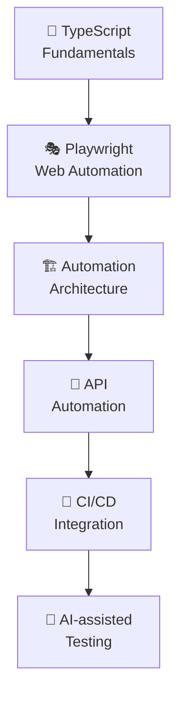
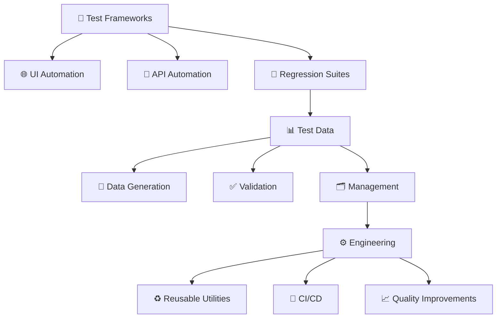

<div align="center">


<br>

<p>
  <a href="https://github.com/saipraveen9911">
    
  </a>
  
</p>

</div>

# 👋 Hello, I'm Sai Praveen

> **QA Engineer passionate about building reliable software through intelligent testing and automation.**

I specialize in **Software Testing, Test Automation, Regression Testing, and Quality Assurance**, with a strong interest in building maintainable automation frameworks and improving testing efficiency.

I enjoy transforming repetitive testing activities into **Reliable, Reusable and Scalable automation solutions**.

---

## 🧑‍💻 About Me

```yaml
Name: Sai Praveen
Role: Senior QA Engineer
Focus:
  - Software Testing
  - Test Automation
  - Quality Assurance 
  - Regression Testing
  - User Acceptance Test

currently_learning:
  - TypeScript
  - Playwright
  - Advanced Test Automation
  - API Testing
  - CI/CD
  - AI-assisted Testing

interests:
  - Automation Frameworks
  - Developer Tools
  - Process Improvement
```

---

## 🧪 Testing Expertise

<div align="center">

|      🔍 Testing     |    🤖 Automation    |     📊 Quality    |
| :-----------------: | :-----------------: | :---------------: |
|  Functional Testing |    UI Automation    | Defect Management |
|  Regression Testing |      Playwright     |   Test Planning   |
| Integration Testing |       Reusable Frameworks      |     Test Data     |
|  End-to-End Testing |      TypeScript     |  Quality Analysis |
|     User Acceptance Testing     | |   Test Reporting  |

</div>

---

## 🛠️ Technology Stack

### 💻 Programming

<p>

</p>

`Typescript` • `Python` 

### 🧪 Test Automation

<p>

  
</p>

`Playwright` • `Selenium` 

### 🔧 Tools & Development

<p>

</p>

`Git` • `GitHub` • `VS Code` • `Node.js` • `npm`

---

## 🚀 Featured Work
<!--
### 🧪 UI Test Automation

Building maintainable automated test suites for web applications with a focus on reliability and reusability.

**Focus Areas**

* Page Object Model
* Reusable components
* Test data management
* Cross-browser testing
* Parallel execution
* Screenshots & traces
* Automated reporting

**Tech:** `TypeScript` `Playwright` `Node.js`

---

### 📊 Test Data Automation

Creating automation solutions to simplify test-data creation and maintenance.

**Focus Areas**

* Excel-based test data
* Data validation
* Automated data generation
* Dropdown handling
* Data uniqueness
* Reusable utilities

**Tech:** `TypeScript` `ExcelJS` `Node.js`
-->
---

## 📚 Currently Learning

<div align="center">
  

</div>

---

### 📈 GitHub Activity

<br>

<div align="center">


</div>

---
  
### 🎯 2026 Goals

* 🚀 Build production-quality automation frameworks
* 🧪 Improve test automation architecture
* 🔌 Expand API automation expertise
* ⚙️ Integrate automation with CI/CD
* 🤖 Explore AI-assisted software testing
* 📚 Build and publish reusable QA tools
  
---

### 🏆 What I Like Building

---

### 💡 QA Philosophy

> "Quality is not just about finding bugs — it's about building confidence in the software."

I believe good QA engineering combines critical thinking, automation, collaboration and continuous improvement.

---

### 🤝 Let's Connect

<div align= "center">

<a href="https://github.com/saipraveen9911">  </a>
&nbsp;&nbsp;
<a href="mailto:saipraveen9911@gmail.com">  </a>

</div>

<!-- Add your LinkedIn profile below -->

<!-- <a href="YOUR_LINKEDIN_URL">  </a> -->


---

<div align= "center">
  
### 💡 "Quality is not an act, it is a habit."


⭐ If you find my projects useful, consider giving them a star!

</div>

<br>


</div>
